### Obsidian Integration with Copilot and Remotely Save

#### Introduction
This guide explains how to install and configure the Copilot and Remotely Save plugins in Obsidian.  
- Copilot integrates AI models, including two custom models:
  - openDossier: sends chat tasks to an n8n workflow
  - openDossier_context: sends selected text via context menu to another n8n workflow that saves files to S3
- Remotely Save syncs your Obsidian vault with an S3 bucket, so files saved by n8n appear locally after sync.

Prerequisites: Obsidian installed, AWS S3 account, n8n instance, and basic API knowledge.

---

### Installing Plugins in Obsidian

#### Install Copilot
1. Open Obsidian
2. Settings → Community plugins → Browse
3. Search “Copilot” (from `logancyang/obsidian-copilot`)
4. Install → Enable in Community plugins

Tip: If issues arise, update Obsidian or restart it.

#### Install Remotely Save
1. Settings → Community plugins → Browse
2. Search “Remotely Save”
3. Install → Enable

Alternative installs (if Browse fails):
- BRAT: add repo `remotely-save/remotely-save`
- Manual: download `main.js`, `manifest.json`, `styles.css` from releases and place into `<vault>/.obsidian/plugins/remotely-save/`

---

### Configuring Remotely Save (S3)

#### Prepare S3
- Create an S3 bucket (e.g., `obsidian-vault-sync`)
- Create an IAM user with minimal permissions:
  - `s3:ListBucket`, `s3:GetObject`, `s3:PutObject`, `s3:DeleteObject`
- Collect:
  - Endpoint (e.g., `https://s3.amazonaws.com`)
  - Region (e.g., `us-east-1`)
  - Access Key ID and Secret Access Key
  - Bucket name
- If using older Obsidian/web flow, set CORS to allow GET/PUT/DELETE and `*` headers.

#### Plugin configuration
Settings → Plugin options → Remotely Save:
- Service: S3
- Endpoint, Region
- Access Key ID, Secret Access Key
- Bucket
- Optional: Prefix (e.g., `my-vault/`) for multiple vaults
- Optional: Password for end-to-end encryption  
Save settings.

#### Sync
- Manual: click the circular-arrow icon (left ribbon) or Ctrl+P → “Remotely Save: Sync”
- Automatic: set interval (e.g., every 5 min). Works while Obsidian is open.
- Sync on Save: enable to push/pull on file saves.

Tips:
- First sync may be slow.
- For large files (>50 MB), enable “Skip Large Files” on mobile.
- Keep consistent vault names across devices.
- Don’t share `data.json` (contains credentials).
- After n8n writes to S3, Remotely Save will pull changes on next sync.

---

### Configuring Custom Models in Copilot

Copilot supports OpenAI-compatible custom models. You’ll add:
- `openDossier` for chat → sends messages to an n8n webhook
- `openDossier_context` for context actions → sends selected text to another webhook that saves to S3

#### Add models in Copilot
Settings → Plugin options → Copilot:
1. API Keys: enter a key if your n8n requires auth (or leave blank)
   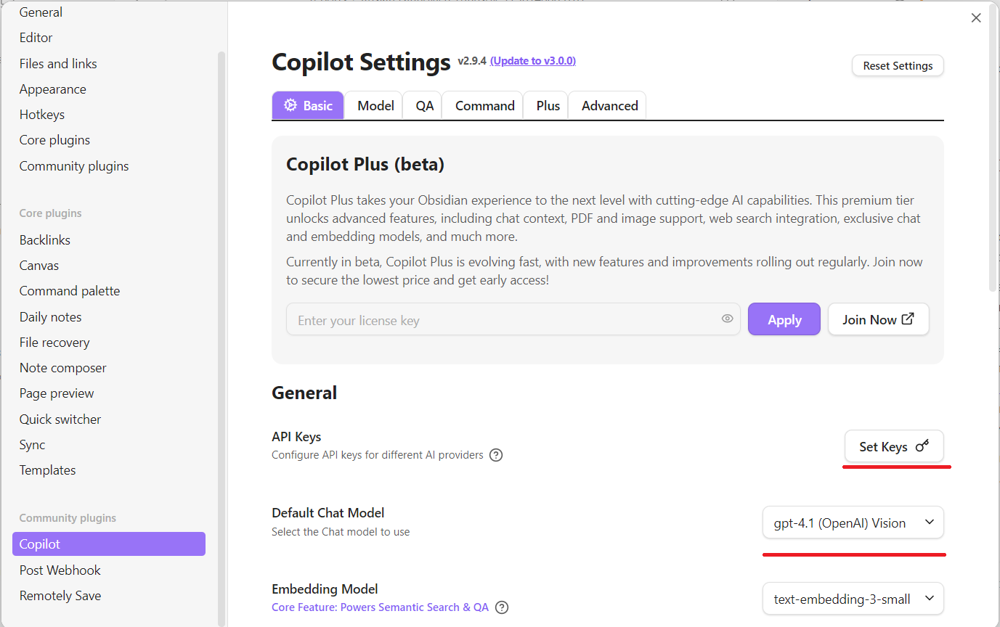
2. Models → Add Custom Model
   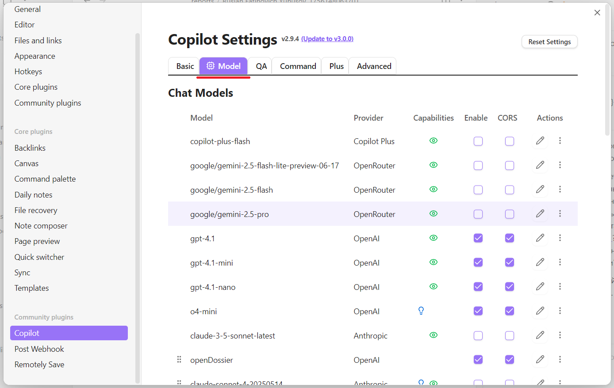
   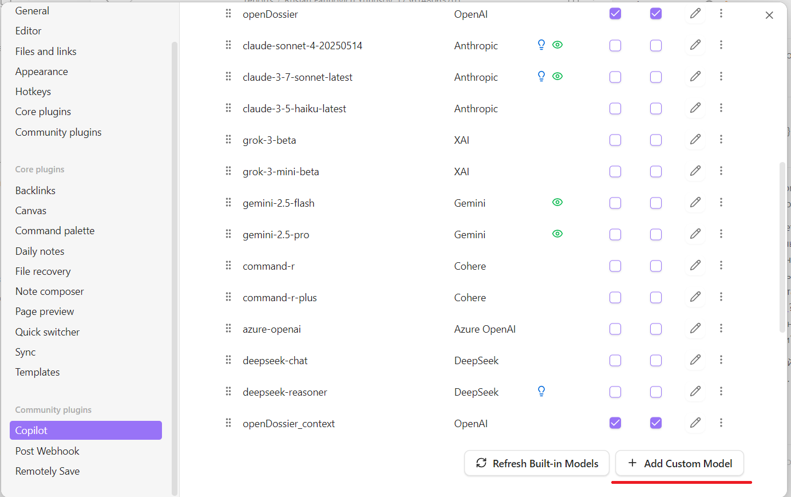
   - For `openDossier`:
     - Model name: `openDossier`
     - Provider: “3rd party (openai format)”
     - Base URL: "http://67.205.167.221:5679/webhook/ddc256e2-69f1-41ab-a369-b0d8ac6df098"
	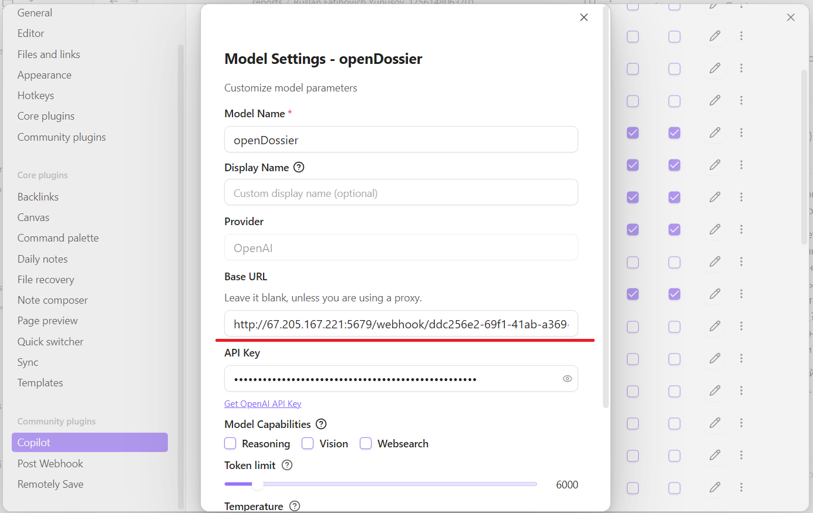
     - API key: if required
     - If CORS errors occur, enable CORS on your endpoint
   - For `openDossier_context`:
     - Same fields, but webhook URL: "http://67.205.167.221:5679/webhook/eb6dda28-2e38-4a27-8d2e-ed1d8a149da6"
     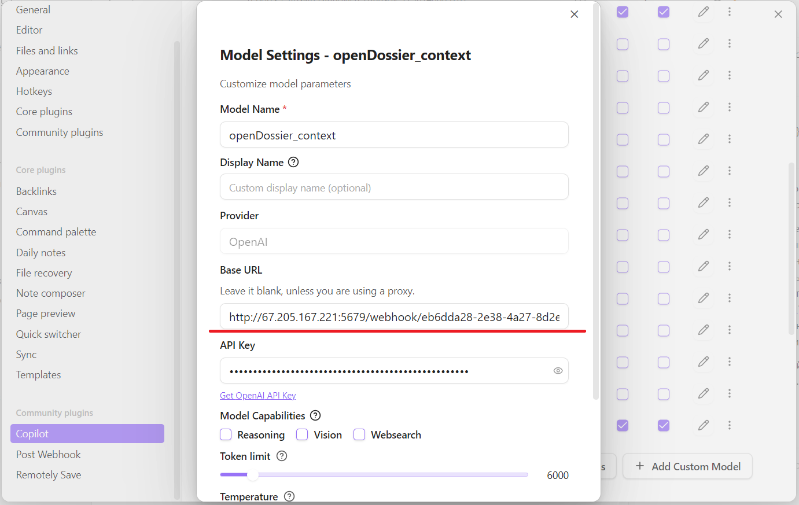
     - Also, go to Command → Add Command:
		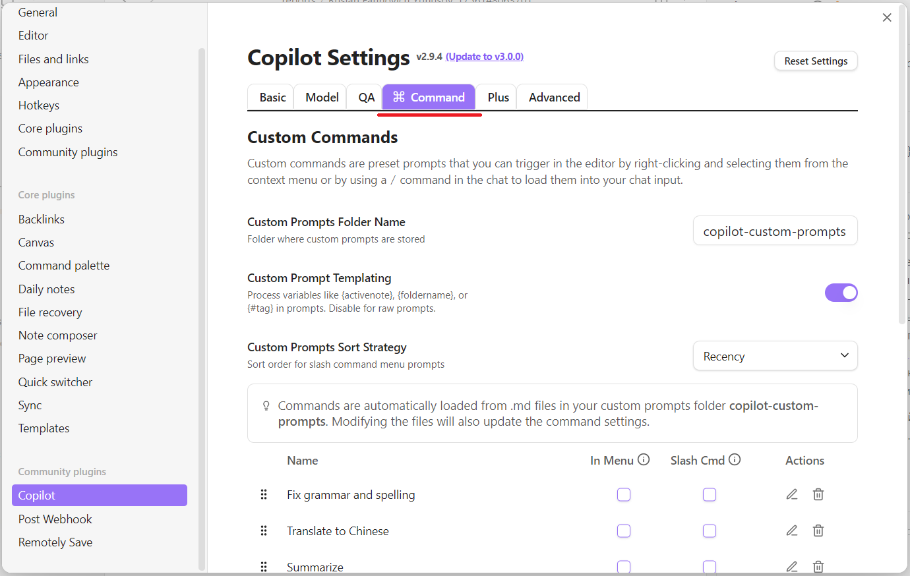
	 - Make settings like on screenshot:
		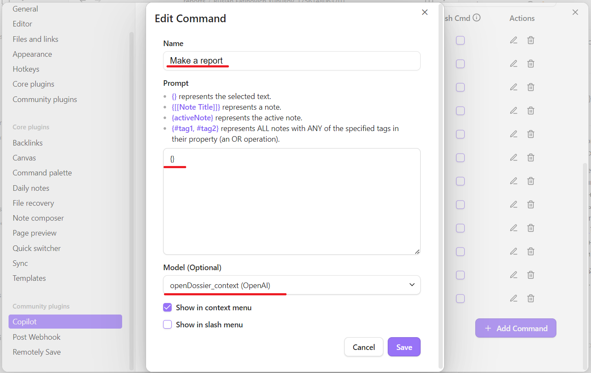
  
	
3. Save
4. Test in Copilot chat by selecting the model and sending a message
   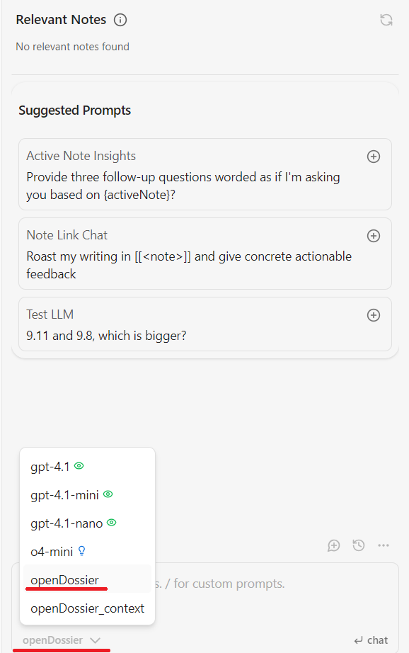

---

### Using the Models

- Chat with `openDossier`:
  - click the chat icon (left ribbon) or Ctrl+P → “Copilot: Open Chat” → select `openDossier` → send a task
  - 
  - Message is forwarded to n8n workflow
  - If you need to ask questions about Report please switch the model in chat window (OpenAI for example). 
  - 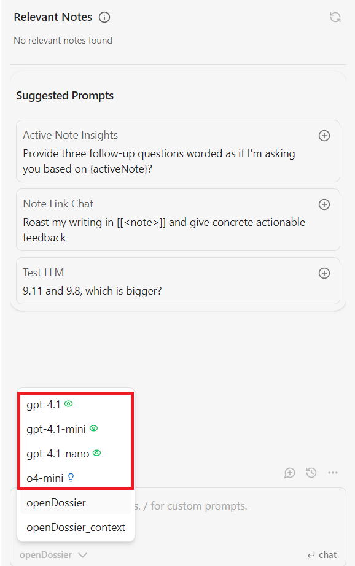

- Context with `openDossier_context`:
  - Select text in a note → Right-click → Copilot context action (or use a custom prompt)
  - 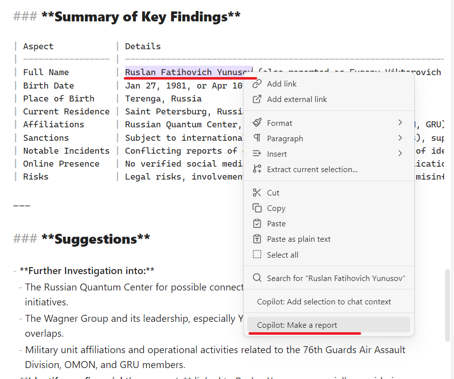
  - Close the window after finishing the request
  - Text is sent to n8n; the workflow saves it as a file to S3 (inside the vault path)
  - Remotely Save syncs the new file to your local vault

All the chat reports and qustions about the chat reports saved to "copilot-conversations" directory (you can rename directory manualy) in your vault.

All the reports generated using context action saved to "reports" directory in your vault.
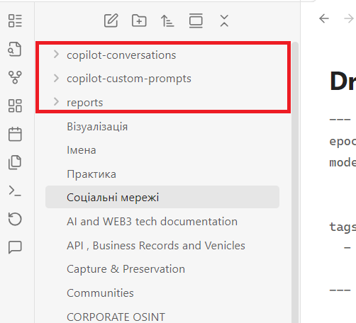

If you need custom prompts:
- Ctrl+P → “Copilot: Add custom prompt” and create one that posts selected text.

### Troubleshooting
- 401/403: configure API key/header in Copilot and n8n.
- CORS: enable CORS on your webhook reverse-proxy (OPTIONS, correct origins/headers).
- Remotely Save not syncing: verify S3 credentials, region/endpoint, and run a manual sync.

--- 

Short summary:
- Installed Copilot + Remotely Save
- Remotely Save syncs vault with S3
- Added two OpenAI-format custom models in Copilot pointing at n8n webhooks
- Chat or context actions forward content to n8n; outputs sync back via S3 
